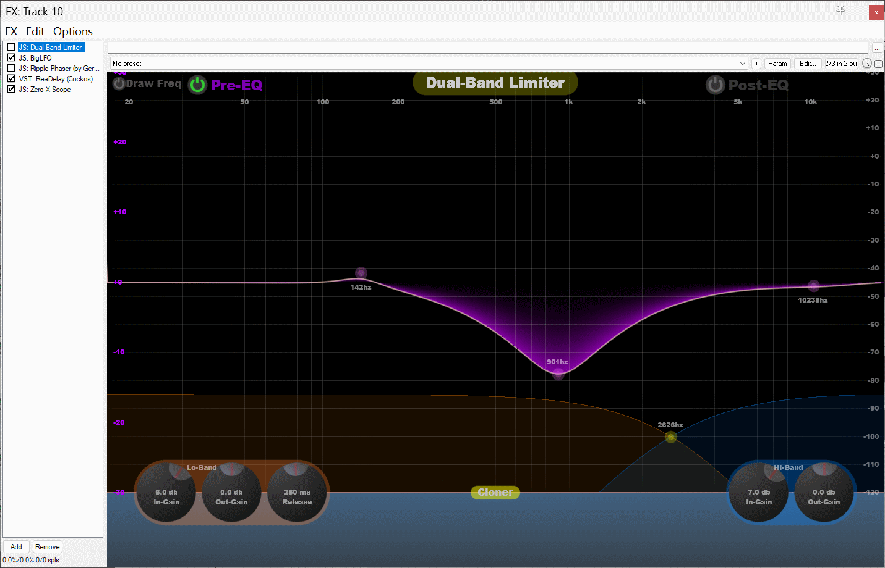

# Dual-Band-Limiter - JSFX
Dual-Band Limiter written in Reapers JSFX

A Very simple Dual-Band Limiter. Uses classic RBJ ([Audio EQ Cookbook](https://www.w3.org/TR/audio-eq-cookbook/)) Bi-Quads to split the signal into two, and process each band separately. Using overlapp and add with a cosine blend to smooth any drastic limit level changes - works really well. Has a super fast Hi-Res FFT - uses a small fifo stack into a Large FFT for fast response times and then gaussian smooth for slick lower frequency display. Added a 3 band pre-eq for gutiar - boost the bass and it will act like a noise reduction system - since the bass limiting will hide alot of the hi-freq noise.

Left some half-assed "cloner" system in there - tries to detect guitar picking and clone the signal with delays to give a big wide "Multi-Tracked" sound. Didn't work at all - sounds like a right old mess - hahhah.

Also added a "Draw Freq" option - tries to identify peaks in the lower end of the FFT and displays the HZ - works, a little messy tho.

"Post EQ" has no code - so it doesn't do anything, might add a 5 band eq later.

Dials can either be "Mouse-Dragged" or "Mouse-wheeled" when hovered over them. Right click will reset the dials value back to the default.

In-Gain - will boost the lower or upper bands and force more aggressive limiting, great for metal \m/ .

Out-Gain controls the bands output levels after limiting.

Limiter level is hardcoded to -1 +1 but can use the in-gain and out-gain for the bands to control the effective limit level. I coded this so all my guitar/edm tracks
are the same peak level and then just mix with post faders.

The FFT display is transformed in the classic 3 band curve - low/mid/high bands using :

function ToCurve(x)             ( 1+0.135*log(x); );
function InvToCurve(x)          ( exp((x-1)/0.135); ); 

Release-Time controls the release time for both limiters, using the Time-Constant math, probably very wrong.

Mouse drag to move the pre-eq Control points and Mouse Wheel to change the Q/Bandwidth.

Mouse drag the yellow circle on the lower part of the screen to change the dual-band freq split, no Q/Bandwidth control on that one.

Coding style is "Wildcat" - i.e. RnD careless rapid coding, probably will refactor it all later :)

